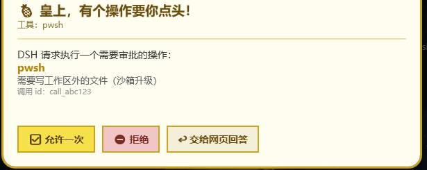
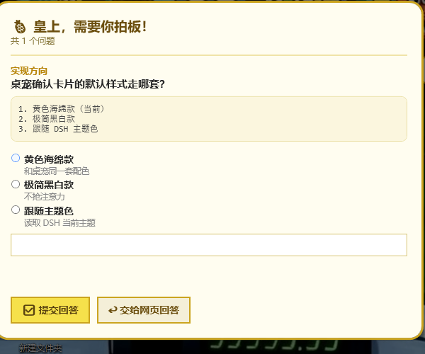

# dsh-spongebob-pet · 海绵宝宝桌宠（DSH 联动插件）

> A desktop pet for the DeepSeek Harness web GUI: approvals and `ask_user_question` requests pop up as a topmost SpongeBob card you can answer directly; launch it from **Settings → Plugins**.

Windows 桌面上的海绵宝宝：DSH 需要**用户确认或选择**（工具审批、`ask_user_question`）时，它跳到屏幕最前面把人叫过来，直接在桌宠卡片上点掉，DSH 立刻继续跑。桌宠本体是零依赖的 PowerShell + WPF（不是 Electron，不下载任何二进制）。

参考实现：[clawd-on-desk](https://github.com/rullerzhou-afk/clawd-on-desk)（Electron 像素宠物 + DSH 宿主插件）。本实现把它的「只接审批」扩到**审批 + 提问**两条 seam。



## 这是一个标准 DSH 插件

| 部分 | 文件 | 说明 |
|---|---|---|
| 清单 | `package.json` | `exports` 指宿主/网页两个半边，`dsh.bundle.patch` + `dsh.client` 声明装配方式 |
| bundle 补丁 | `cordis.patch.yml` | 把自己插进 profile 插件树的那三行 |
| 宿主半边 | `lib/index.js` | cordis 插件：接管 `approval/request`、`user-questions/request`，在 dsh web 服务器上开 `/pet/*` 路由，拉起/结束桌宠 |
| 网页半边 | `lib/client.js` | 手写 bundle（`window.__ModuleLoader__.load`）：往「设置 → 插件」加一个标签页 |
| 桌宠资产 | `pet/` | 桌宠本体（PowerShell + WPF）随包分发，插件按**相对自身**的路径调用，不写死盘符 |

```
DSH(工具要审批) ──waterfall──▶ lib/index.js ──HTTP/长轮询──▶ 桌宠卡片（置顶/压暗/响铃）
                                    ▲                            │
                                    └────── POST /pet/answer ─────┘   （点「允许一次」即刻返回 allowed-once）
```

## 安装

```powershell
# 1. 装进 web profile（本机源码目录）
dsh plugin --profile web add %USERPROFILE%\.dsh\plugin-src\dsh-spongebob-pet

# 2. 重启 dsh web（或用设置里 dsh-self-update 的「重启」按钮）
dsh web

# 3. 打开设置 → 插件 → 「海绵宝宝桌宠」→ 点「启动桌宠」
```

也可以从 GitHub 直接装：`dsh plugin --profile web add github:<你的用户名>/dsh-spongebob-pet`。

卸载：

```powershell
dsh plugin --profile web remove dsh-spongebob-pet
# 再从 profiles/web/package.json 的 dsh.profile.bundles 里删掉 dsh-spongebob-pet
```

## 行为与回退

| 情形 | 结果 |
|---|---|
| 桌宠在线且非免打扰 | 桌宠接管，卡片弹到最前；作答后 DSH 按答案继续 |
| 桌宠没启动 / 离线 >30 秒 | 立刻 `next()`，交回 DSH 原生网页确认，不阻塞 |
| 卡片上点「交给网页回答」或按 `Esc` | 同上，转交网页 |
| 超过超时（审批 180 秒 / 提问 600 秒） | 同上，转交网页 |
| 请求被 DSH 撤销（abort） | 卡片自动关闭，结算为 `cancelled` |
| DSH 断开超过 30 秒（重启/退出） | 在途卡片自动关闭并清空待答，重连后由 DSH 重新发起；不会留一张点了没反应的假卡片 |
| 会话策略 `never` | DSH 在自己内部先拒绝，桌宠无从插手 |
| 托盘「免打扰」 | 不再接管，全部回网页 |

安全边界：`/pet/*` 只挂在仅回环的 dsh web 服务器上、要求 `~/.dsh/pet-bridge.json` 里的随机令牌（每次 DSH 启动重新生成）。设置页那个标签页拿不到令牌（浏览器读不了磁盘），走 `/pet/ui/*` 并改用**同源校验**挡 CSRF：POST 必须带 `Origin` 且等于本站，GET 认 `sec-fetch-site`。

## 桌宠状态

| 状态 | 触发 | 表情 |
|---|---|---|
| `idle` | 无活跃轮次 | 待机，轻微摇摆 |
| `thinking` | `turn/start` | 眼珠上瞟 + 「…」 |
| `working` | 工具调用 / 助手输出 | 双臂上下忙活 |
| `error` | 工具失败 / 轮次异常结束 | 叉眼 + 汗滴 |
| `asking` | 有待答请求 | 举双手 + 感叹号 + 「皇上，需要你拍板！」 |
| `sleep` | DSH 失联 | 闭眼 + 「z Z」 |

## 交互

- 左键拖动：挪位置（退出时记住；分辨率变化导致跑到屏幕外会自动拉回右下角）
- 右键 / 托盘：显示隐藏、免打扰、**大小（大/中/小）**、打开 DSH 网页、回到右下角、退出
- **大小三档**：`大` 220×284（默认）、`中` 158×204、`小` 110×142；三个入口都能改，改完 4 秒内生效，不用重启桌宠
  1. 右键菜单 / 托盘图标 → 大小
  2. 设置 → 插件 →「海绵宝宝桌宠」→ 大小
  3. 直接改 `pet/config.json` 的 `size`（桌宠每 ~2.4 秒读一次跟随）
- 卡片：审批＝`允许一次` / `拒绝` / `交给网页回答`；提问＝按题勾选或直接写自定义回答 + 提交
- 卡片的压暗遮罩默认开启（`pet/config.json` 的 `dimScreen`），点不到背后窗口，逼你处理；不想这么凶就设 `false`



## 目录

```
dsh-spongebob-pet/           ← 这个目录就是插件包，也是要上传的 GitHub 项目
├─ package.json              清单（main / exports / dsh.bundle / dsh.client）
├─ cordis.patch.yml          bundle 层：把自己插进 profile 树
├─ lib/
│  ├─ index.js               宿主半边：审批+提问接管、/pet/* 路由、拉起桌宠
│  └─ client.js              网页半边：设置 → 插件 的标签页
├─ pet/                      桌宠本体（插件资产）
│  ├─ SpongeBobPet.ps1       主程序：窗口、托盘、状态机、取件循环
│  ├─ lib/Art.ps1            海绵宝宝矢量形象（XAML）与表情元素索引
│  ├─ lib/Card.ps1           确认/选择卡片
│  ├─ lib/Ui.ps1             Win32 调用（置顶/抢焦点/闪烁）与控件工厂
│  ├─ start-pet.cmd          启动器（无参数双击即可）
│  ├─ restart-pet.cmd        先清残留再启动
│  ├─ stop-pet.ps1           结束所有桌宠实例
│  ├─ install-autostart.ps1  写开机自启快捷方式
│  └─ config.json            配置
├─ test/                     smoke.mjs（17 项逻辑自测）、pet-server.mjs（联调假 DSH）
├─ tools/                    check-syntax（语法关）、restart-dsh（看门狗重启）、verify-live（四项硬证据）
└─ docs/                     截图
```

## 配置

`pet/config.json`：

| 字段 | 默认 | 含义 |
|---|---|---|
| `topmost` | `true` | 宠物窗口是否常驻置顶 |
| `dimScreen` | `true` | 卡片弹出时是否全屏压暗 |
| `sound` | `true` | 弹出提示音 |
| `dnd` | `false` | 免打扰；桌宠连上 DSH 后会把这个开关同步过去（也可从托盘切换，会写回本文件） |
| `opacity` | `1.0` | 宠物透明度 |
| `size` | `large` | 大小档位：`large`（大，220×284）/ `medium`（中，158×204）/ `small`（小，110×142） |
| `bridgeUrl` | `""` | 留空＝读握手文件里的地址 |
| `pollTimeout` | `40` | 长轮询客户端超时（秒） |
| `position` | `-1,-1` | 记住的位置，`-1` 表示右下角 |

`lib/index.js` 顶部的 `DEFAULTS` 可改接管超时、离线判定、事件缓冲、桌宠路径等。

## 验证过的行为

| 项 | 方式 | 结果 |
|---|---|---|
| 桥接逻辑 17 项（令牌、取件、审批允许/拒绝、提问作答与非法选项、委派、超时、离线、免打扰） | `node test/smoke.mjs` | 17/17 通过 |
| 审批：允许 / 拒绝 | 假 DSH 触发 → 模拟点击卡片按钮 | DSH 侧收到 `allowed-once` / `rejected` |
| 提问：单选 + 多选 + 自定义回答 + 跳过 | UI Automation 驱动真卡片作答 | `{"answers":[{"id":"q1","selected":[]},{"id":"q2","selected":["桥接插件","文档"]},{"id":"q3","selected":[],"custom":"这是桌宠写的自定义回答"}]}`，中文无损 |
| 委派：`Esc` / 「交给网页回答」 | 按下 Esc | 桥接侧走 `next()`，回落原生网页应答者 |
| 免打扰 | `config.json` 置 `dnd=true` 后冷启动再触发审批 | 桌宠上线 5 秒内完成同步，审批直接回落（`unavailable`），不弹卡 |
| DSH 断开清理 | 弹着卡片时杀掉桥接服务 | 30 秒后卡片自动关闭、待答清空，桌宠不残留假卡片 |
| 压暗遮罩 | 对比弹卡前后屏幕亮度 | 13.9 vs 25.0（≈44% 变暗） |
| 插件挂载 | `dsh --profile web --dump-config` | 配置树中出现 `id: spongebob-pet` |
| **真机 DSH 链路** | 重启 `dsh web` 后由真人作答；轮询桥接 + UI Automation 留证 | `pending=1 state=asking 卡片窗口:在屏=True` → 卡片上点击 → `pending=0`，答案回传 DSH |
| 语法自检关 | `tools/check-syntax.ps1`；反向测试一个「两行并一行」的文件 | 16 个文件全过；反向测试按预期失败（退出码 1） |
| 大小三档（启动时） | 逐个档位写 `config.json` → 启桌宠 → UIAutomation 量窗口 | 大 330×426 / 中 237×306 / 小 165×213 物理像素（150% 缩放） |
| 大小三档（运行中切换） | 桌宠跑着时只改 `config.json` | 4 秒内跟随：165×213 → 330×426 → 237×306，日志留痕「配置文件里的档位变成 …，跟随切换」 |

## 改代码的安全流程（血泪教训）

2026-09-10 出过一次**插件语法错导致 `dsh web` 直接起不来**的事故：`lib/index.js` 里 `let last = ...` 与 `const timer = ...` 之间的换行被编辑操作吃掉，两条语句并成一行，无分号语句失去 ASI 依据 → ESM 解析失败 → 插件树加载失败 → DSH 进程 exit（报错 `failed to import loader entry spongebob-pet Unexpected token 'const'`）。

现在有三道防线，改完插件**按顺序**走：

| 步骤 | 命令 | 作用 |
|---|---|---|
| 1. 语法关 | `powershell -ExecutionPolicy RemoteSigned -File tools\check-syntax.ps1` | JS 走 `node --check`、PS1 走 PowerShell 解析器、JSON 走 `ConvertFrom-Json`；任何一项不过就退出码 1 |
| 2. 重启（自带第 1 步） | `tools\restart-dsh.ps1` | 重启前先跑语法关，**不过就拒绝重启**（DSH 保持原状，不会被带崩） |
| 3. 链路自检 | `tools\verify-live.ps1` | 插件路由 + 桌宠进程 + 窗口在屏 + 长轮询心跳，四项硬证据 |

**注意**：

- 本目录下的 `.ps1` 必须存成 **UTF-8 带 BOM**（Windows PowerShell 5.1 没 BOM 就按 GBK 读，中文变乱码会直接语法报错）；`tools/verify-live.ps1` 特意写成纯 ASCII 免踩这个坑。
- 本机执行策略是 `Restricted`，跑脚本一律带 `-ExecutionPolicy RemoteSigned`。
- 杀软（如火绒）会拦「node / WMI 直接 spawn powershell」这条链：所以插件**优先让 `explorer.exe` 执行 `pet/start-pet.cmd`**（等价于用户双击，不拦），直接 spawn 只是退路。

## 故障排查

| 现象 | 原因 / 处理 |
|---|---|
| 设置页三个按钮点了没反应 | 桌宠不是插件拉起的（`petRunning` 只认子进程）——v0.4.0 起改成"子进程活着**或**长轮询心跳在线"，重启 DSH 后生效 |
| 桌宠一直显示「DSH 没连上」 | `dsh web` 没重启（插件未加载）；确认 `~/.dsh/pet-bridge.json` 存在 |
| 卡片不弹，DSH 网页照常确认 | 桌宠没运行 / 已免打扰 / 离线判定超时；看桌宠气泡文案与 `pet/pet.log` |
| 桌宠起不来 | 前台跑一次看报错：`powershell -ExecutionPolicy RemoteSigned -STA -File pet\SpongeBobPet.ps1`；看 `pet/pet.log` |
| 双击启动器被杀软删掉 | 把项目目录加进杀软信任区；或直接用设置页的「启动桌宠」 |
| 双开 | 有单实例互斥，第二次启动会直接退出 |
| 改完 `pet/**/*.ps1` 后乱码报错 | 文件必须存成 **UTF-8 带 BOM** |

## 版权

代码 [MIT](LICENSE) © 2026 4AM-Forever。形象是自用同人画（用矢量图形现画，不含任何官方素材），外观参考《海绵宝宝》，角色版权归 Nickelodeon。
